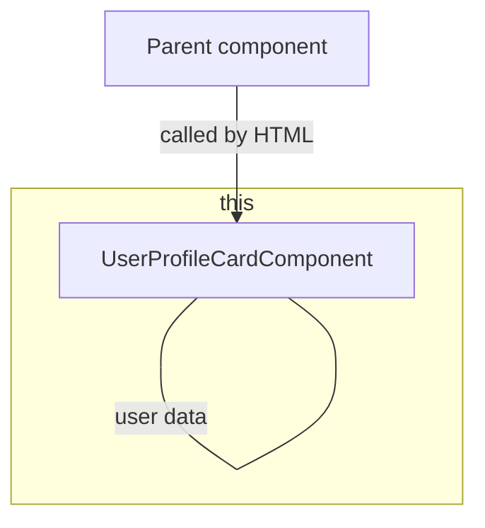

# Creation

## User Profile Card

:::info Exercise

Create a simple Angular component, such as a user profile card, with hardcoded data and display it in the template.

:::

This can be used als UI draft:


For the user data you can assume `User` as object interface.

```typescript title="user.model.ts"
export interface User {
    firstName: string,
    lastName: string,
    mail: string;
}
```

### Goal architecture



### Lets go
[](https://stackblitz.com/edit/nt-angular-workshop-base)


### Solution

<details>
  <summary>click to see the solution</summary>
  <div>
There are several ways to do this. Angular gives you the possibility to reduce boilerplate code by using the generator
via CLI.

```bash
ng generate component UserProfileCard --standalone 
# shorted version
ng g c UserProfileCard --standalone 
```

If you use NX:

```bash
nx g @nx/angular:component UserProfileCard --standalone
```

This will generate a component containing:

```logs
>  NX  Generating @nx/angular:component
CREATE .../user-profile-card.component.ts
```

If you create a single file it can look like this:

```typescript title="user-profile-card.component.ts"
import { Component, computed, signal } from '@angular/core';
import { CommonModule } from '@angular/common';
import { User } from '@shared/models'

@Component({
    selector: 'app-user-profile-card',
    standalone: true,
    imports: [CommonModule],
    templateUrl: './user-profile-card.component.html',
    styleUrls: ['./user-profile-card.component.scss'],
})
export class UserProfileCardComponent {
    readonly user = signal({ firstName: 'Nora', lastName: 'Crawford', mail: 'nora.crawford@dev.io' } as User);
    readonly userInitials = computed(
        () =>
            `${this.user().firstName.trimStart().slice(0, 1).toUpperCase()}${this.user().lastName.trimStart().slice(0, 1)}`
    );
    readonly fullName = computed(() => `${this.user().firstName} ${this.user().lastName}`);

    onShowDropdownClicked() {
        console.debug('on show dropdown clicked');
    }
}
```

```html title="user-profile-card.component.html"
<div class="upc__avatar">
    {{ userInitials() }}
</div>
<div class="upc__container">
<div class="upc__name">{{ fullName() }}</div>
<div class="upc__mail">{{ user().mail }}</div>
</div>
<button class="upc__show-dropdown" (click)="onShowDropdownClicked()">V</button>
```

[](https://stackblitz.com/edit/ex-base-create-component?file=src%2Fapp%2Fuser-profile-card%2Fuser-profile-card.component.ts)

  </div>
</details>
