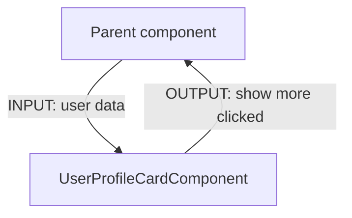

# Increase Reusability

## User Profile Card

:::info Exercise

Add the possibility to pass user data from the parent using HTML params (`@Input`).  
And ensure the show more click can be handled on parent level (`@Output`).

:::

This can be used als UI draft:


For the user data you can assume `User` as object interface.

```typescript title="user.model.ts"
export interface User {
    firstName: string,
    lastName: string,
    mail: string;
}
```

### Goal architecture



### Lets go

[](https://stackblitz.com/edit/ex-base-testing-component?file=src%2Fapp%2Fuser-profile-card%2Fuser-profile-card.component.ts)

### Solution

<details>
  <summary>click to see the solution</summary>
  <div>

[](https://stackblitz.com/edit/ex-base-reusable-component?file=src%2Fapp%2Fuser-profile-card%2Fuser-profile-card.component.spec.ts,src%2Fapp%2Fuser-profile-card%2Fuser-profile-card.component.ts)

```typescript title="user-profile-card.component.ts"
import {User} from '@shared/models'
import {Component, EventEmitter, Input, Output, Signal, computed, signal} from '@angular/core';
import {CommonModule} from '@angular/common';

@Component({
    selector: 'app-user-profile-card',
    standalone: true,
    imports: [CommonModule],
    templateUrl: './user-profile-card.component.html',
    styleUrls: ['./user-profile-card.component.scss'],
})
export class UserProfileCardComponent {
    /**
     * HINT: This way to input will be changed on angular 17, when we can use signal components.
     * @required
     */
    @Input({alias: 'user', required: true, transform: (user: User) => signal<User>(user)})
    user!: Signal<User>;

    /**
     * Emitts when the button was clicked.
     */
    @Output() readonly showMoreClicked = new EventEmitter<void>();

    /**
     * @returns text containing the first letter of the {@link User.firstName} and first letter of the {@link User.lastName}.
     *
     * example:
     *
     * firstName: 'Nora'; lastName: 'Crawford' ==> "NC"
     */
    readonly userInitials = computed(() =>
        this.user
            ? `${this.user().firstName.trimStart().slice(0, 1).toUpperCase()}${this.user().lastName.trimStart().slice(0, 1)}`
            : ''
    );

    /**
     * @returns text containing "{@link User.firstName} _space_ {@link User.lastName}"
     */
    readonly fullName = computed(() => (this.user ? `${this.user().firstName} ${this.user().lastName}` : '—'));

    /**
     * triggers emit
     */
    onShowDropdownClicked() {
        this.showMoreClicked.emit();
    }
}

```

```typescript title="user-profile-card.component.spec.ts"
import {User, UserProfileCardComponent} from './user-profile-card.component';
import {MockBuilder, MockRender, MockedComponentFixture, ngMocks} from 'ng-mocks';
import {firstValueFrom} from 'rxjs';

describe('UserProfileCardComponent', () => {
    let component: UserProfileCardComponent;
    let fixture: MockedComponentFixture<UserProfileCardComponent>;

    beforeEach(() => MockBuilder(UserProfileCardComponent));

    it('should create', () => {
        fixture = MockRender(UserProfileCardComponent, {user: mockUserA} as any);
        component = fixture.point.componentInstance;
        fixture.detectChanges();
        expect(component).toBeTruthy();
    });

    describe('public data', () => {
        beforeEach(() => {
            fixture = MockRender(UserProfileCardComponent, {user: mockUserA} as any);
            component = fixture.point.componentInstance;
            fixture.detectChanges();
        });

        describe('user', () => {
            it('should provide the correct user', () => {
                expect(component.user()).toStrictEqual(mockUserA);
            });

            it('should provide correct initials', () => {
                expect(component.userInitials()).toEqual('NC');
            });

            it('should provide correct full name', () => {
                expect(component.fullName()).toEqual('Nora Crawford');
            });
        });
    });

    describe('ui tests', () => {
        it('should match snapshot', () => {
            fixture = MockRender(UserProfileCardComponent, {user: mockUserB} as any);
            fixture.detectChanges();
            expect(fixture.point.nativeElement).toMatchSnapshot();
        });

        it('should show initials within `.upc__avatar`', () => {
            fixture = MockRender(UserProfileCardComponent, {user: mockUserC} as any);
            fixture.detectChanges();

            const avatarComponent = ngMocks.find('.upc__avatar');
            expect(avatarComponent.nativeElement.textContent).toContain('LY');
        });

        describe('show more', () => {
            let onShowMoreClickSpy: jest.SpyInstance;

            beforeEach(() => {
                fixture = MockRender(UserProfileCardComponent, {user: mockUserD} as any);
                component = fixture.point.componentInstance;
                fixture.detectChanges();

                // Arrange
                onShowMoreClickSpy = jest.spyOn(component, 'onShowDropdownClicked');
            });

            it('should trigger click handler on click event', () => {
                const showMoreBtn = ngMocks.find('button.upc__show-dropdown');
                // Act
                ngMocks.click(showMoreBtn);
                // Assert
                expect(onShowMoreClickSpy).toHaveBeenCalledTimes(1);
            });

            it('should trigger output event on click show more', async () => {
                const asyncOutput = firstValueFrom(component.showMoreClicked.asObservable());
                const showMoreBtn = ngMocks.find('button.upc__show-dropdown');
                // Act
                ngMocks.click(showMoreBtn);
                // Assert
                const event = await asyncOutput;
                expect(event).toBe(void 0);
            });
        });
    });
});

const mockUserA: User = {firstName: 'Nora', lastName: 'Crawford', mail: 'nora.crawford@dev.io'};
const mockUserB: User = {firstName: 'Erin', lastName: 'Phillips', mail: 'erin.phillips@devs.google.de'};
const mockUserC: User = {firstName: 'Larissa', lastName: 'Young', mail: 'young.larissa@stanford.edu'};
const mockUserD: User = {firstName: 'Frank', lastName: 'Roberson', mail: 'franky-rob@dude.cool'};
```

  </div>
</details>
