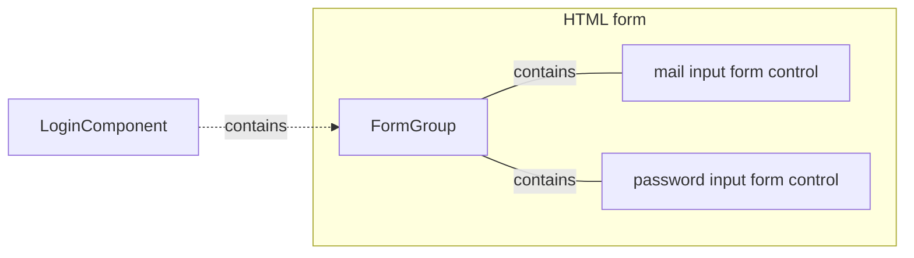

# Form handling

## Reactive Forms

:::info Exercise

Create a simple form with input fields and a submit button (_you can use the `/login` page_).
Implement basic form validation using Angular's built-in `Validators`.

:::

This can be used als UI draft:

### Requirements

Implement the following requirements:

1. Email Field:
    - This field is required.
    - Validation: Must match the email pattern (e.g., example@email.com).
    - Visual Feedback: If invalid and touched, highlight the field in red.
2. Password Field:
    - This field is required.
    - Visual Feedback: If invalid and touched, highlight the field in red.
3. Error Message:
    - Display a message at the bottom of the form indicating that both the email and password are required.
      This message should be shown whenever an invalid field is touched.
4. Login Button:
    - Initial State: Disabled.
    - Enablement Condition: The form must be valid (both email and password fields meet the requirements).

### Goal architecture

### Lets go

Please use the `ReactiveFormModule` to perform this task.

### Solution

  
click to see the solution

  

There are several ways to do this. 

  

