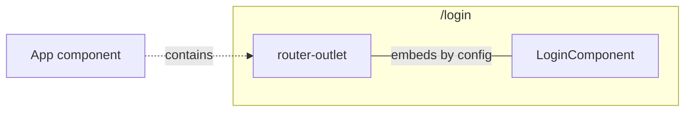

# Setup

## Function-based Routing

:::info Exercise

Create a simple Angular component, such as a login page, with hardcoded data and display it in the template.
Make it accessible using the `/login` route.

:::

This can be used als UI draft:


### Goal architecture



### Lets go

[](https://stackblitz.com/edit/nt-angular-workshop-base)

### Solution

<details>
  <summary>click to see the solution</summary>
  <div>
There are several ways to do this. 
Since Angular 15, we can use function-based routing. The module based approaches are still functional.

First, create at least components for the pages:

```bash
ng g c login --standalone 
ng g c home --standalone 
```

Provide a file called `src/router.config.ts` and export `appRoutes`.

```typescript title="router.config.ts"
import {Routes} from '@angular/router';

export const appRoutes: Routes = [
    {path: 'login', loadComponent: () => import('./login/login.component').then((m) => m.LoginComponent)},
    {path: 'home', loadComponent: () => import('./home/home.component').then((m) => m.HomeComponent)},
    {path: '**', redirectTo: 'home'},
];
```

In this way you can ensure the page will be provided in a lazy-loaded way.
It will create a separate javascript module, so you can reduce the initial loading time.

```typescript
loadComponent: () => import('./path/to/your.component').then((m) => m.YourComponent)
```

The `appRoutes` should now be used with the function based provider.
It can be included on the `app.module.ts` or you can ensure to use the new `bootstapApplication()` (
requires `AppComponent` to be `standalone=true`) to provide the router directly at bootstrapping.

```typescript title="main.ts"
bootstrapApplication(AppComponent, {
    providers: [provideRouter(appRoutes)],
}).catch((err) => console.error(err));
```

Ensure the `app.component.html` contains a `<router-outlet></router-outlet>` and imports `RouterModule`.

Not the route to home component (`http://.../home`) and to login component (`http://.../login`) should be ready to use.

[](https://stackblitz.com/edit/ex-base-routing-setup?file=src%2Fapp%2Fapp.component.html,src%2Fapp%2Flogin%2Flogin.component.ts,src%2Fmain.ts,src%2Fapp%2Fapp.component.ts,src%2Frouter.config.ts)

  </div>
</details>
