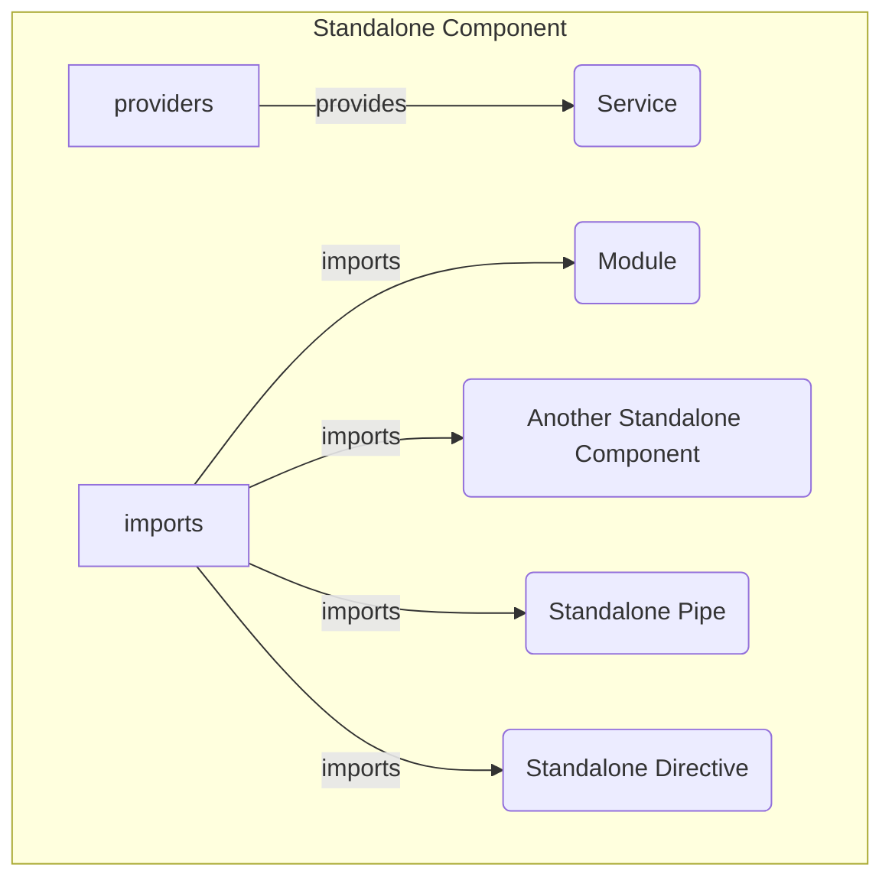

# Components

Components are the basic building blocks of an Angular application. 
They control a part of the UI and encapsulate the logic and template.

## Overview



## Usage

They are defined using the `@Component` decorator.

```typescript title="your.component.ts"
@Component({
    selector: 'app-your-comp',
    standalone: true,
    imports: [],
    providers: [],
    templateUrl: './your.component.html',
    styleUrls: ['./your.component.scss']
})
export class YourComponent {
}
```
