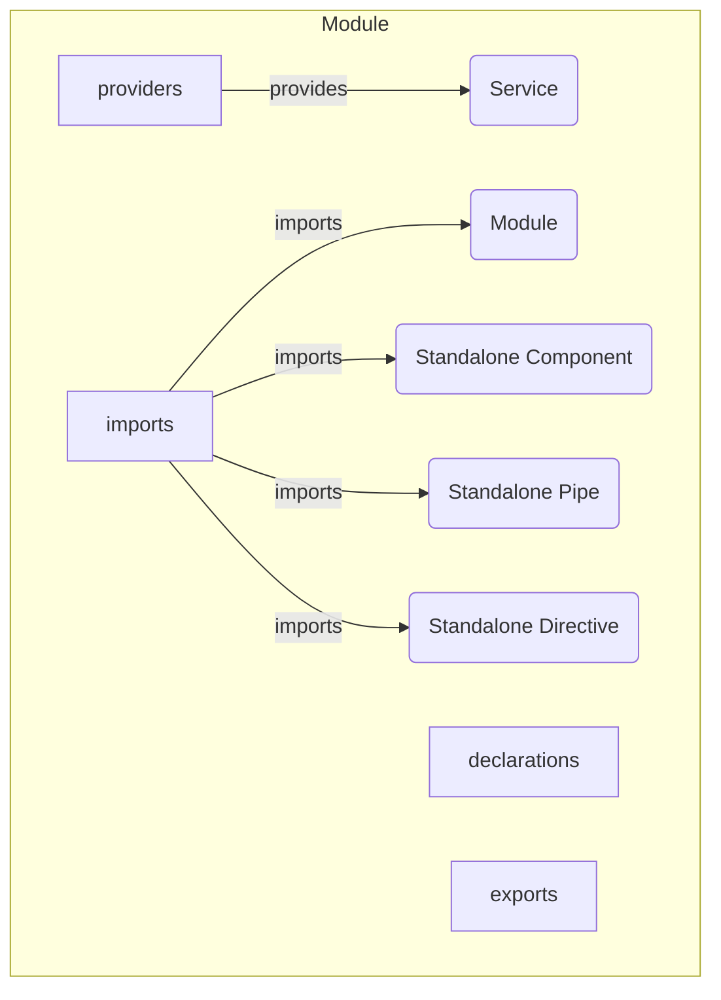
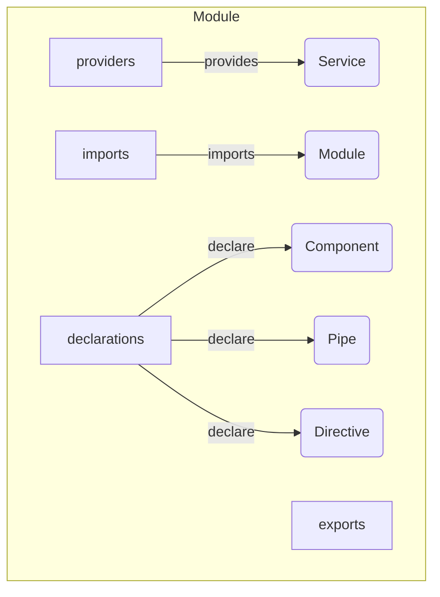

# Modules

Modules in Angular help organize an application into cohesive blocks of functionality.
They group related components, directives, pipes, and services.

## Overview



<details>
  <summary>Before Standalone v15.0.0</summary>
  <div>



</div>
</details>

## Usage

They are defined using the `@NgModule` decorator.

```typescript
@NgModule({
    imports: [],
    providers: [],
    exports: []
    // declatations: [],
})
export class YourModule { }
```
