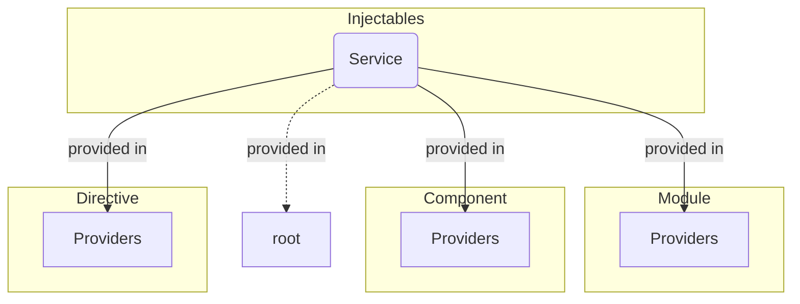

# Services

Services in Angular are singletons that are responsible for encapsulating shared logic, such as data fetching, logging,
or other utility functions. Services can be consumed using dependency injection.

## Overview



## Usage

They are defined using the `@Injectable()` decorator.

Singleton Service on injected on root level:

```typescript title="your.service.ts"
@Injectable({
    provideIn: 'root'
})
export class YourService {
}
```

Service can be injected on specific Components or Modules:

```typescript title="your.service.ts"
@Injectable()
export class YourService {
}
```

### Related Topics

- https://angular.io/guide/creating-injectable-service
