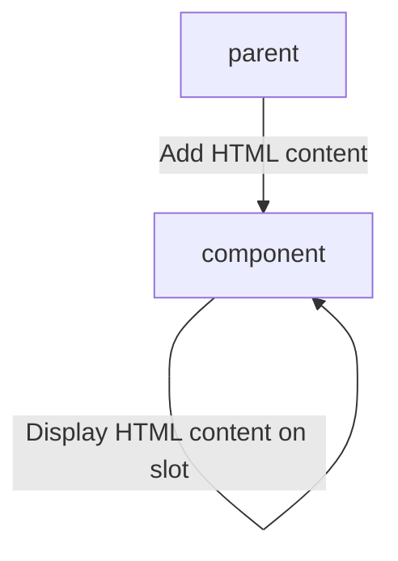

# Content Projection

Content projection is a pattern in which you insert, or project, the content you want to use inside another component.



## Usage

Definition of component:

```typescript title="accordion.component.ts"
@Component({
    selector: 'app-accordion',
    template: `
    <h2 class="accordion__title">{{ title }}</h2>
    <div class="accordion__container">
        <ng-content></ng-content>
    </div>    
  `
})
export class AccordionComponent {
    // ...
}
```

Example Usecase:

```html title="parent.component.html"

<app-accordion [heading]="'Name of section'">
    <p>Some text from parent</p>
</app-accordion>
```

### Why should we use this?

This way of binding can be really helpful for library components which aim for great developer experience and
customization.

---

### Related Topics

- https://angular.io/guide/content-projection
