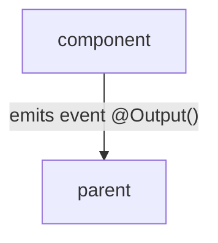

# Event Binding



## Usage

```html title="parent.component.html"

<your-component (yourEvent)="onYourEvent($event)"/>
```

---

### Related Topics

- [Component](/docs/slides/foundation/building-blocks/components)
- https://angular.io/guide/event-binding
