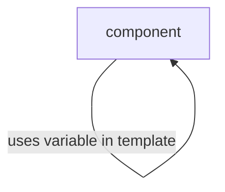

# Interpolation



## Usage

```html
<span> {{ user.email }} </span>
```

---

### Related Topics

- [Component](/docs/slides/foundation/building-blocks/components)
- https://angular.io/guide/component-interaction
