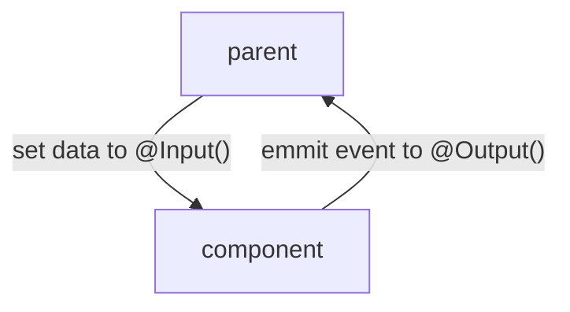

# Two-way Binding

:::caution

Two-way bindings can make the maintainability of data flows extremely difficult.

> I would highly recommend **unidirectional** dataflow usage!

:::



Two-way Bindings are also called **Banana-Box**. 
This can help to remember the order of brackets, if you imagine a box `[ ]` with bananas `( )` inside.

## Usage

```html
<app-your-component [(mail)]="user.email" />

<!-- most common usage is `[(ngModel)]` -->
<input [(ngModel)]="user.email" />
```

## Limitations

There are several reasons to be cautious about using Two-Way Binding in Angular:

- **Complexity and Understandability:**
  Two-Way Binding can affect the readability and comprehensibility of the code. It's not always immediately clear where
  a particular change is coming from, as it could originate from the template or the component.
- **Unpredictable Behavior:**
  In complex applications with many components, Two-Way Binding can lead to unexpected behavior, especially when
  multiple data sources are involved.
- **Performance Overheads:**
  Two-Way Binding requires additional monitoring and updates, which can lead to performance overhead, especially in
  large applications with many data bindings.
- **Debugging Difficulties:**
  In case of errors or malfunctions, it can be harder to identify the root cause of the problem, since the data can be
  influenced by both the template and the component.
- **Coupling of Components and Templates:**
  Two-Way Binding can lead to components and templates being tightly coupled, which can hinder the reusability and
  testability of the components.

---
### Related Topics

- https://angular.io/guide/two-way-binding
