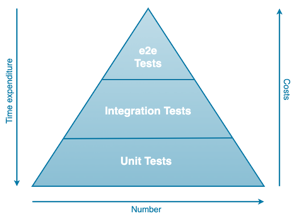

# Intro

## What is Software Testing?

Easiest way to test an app:

- Try it out manually

:::info Definition

Software Testing is a method to check whether the actual software product matches expected requirements and to ensure
that software product is Defect free.
It involves execution of software/system components using manual or automated tools to evaluate one or more properties
of interest.
The purpose of software testing is to identify errors, gaps or missing requirements in contrast to actual
requirements [1].

:::

## Why do we test?

:::info TARGET

Make sure our application works as intended!

:::

| Issue                                             | Solution                                              |
|---------------------------------------------------|-------------------------------------------------------|
| Manual testing alone takes a lot of time & effort | **Automated Testing**                                 |
|                                                   | - Easily executed                                     |
|                                                   | - Saving time                                         |
|                                                   | - Gives confidence about changes not breaking the app |

## Types of Automated Software Tests

---

### Sources

1. Rungta, K. (n.d.). Software Testing. What is Software Testing? Definition, Basics &
   Types. https://www.guru99.com/software-testing-introduction-importance.html. 

